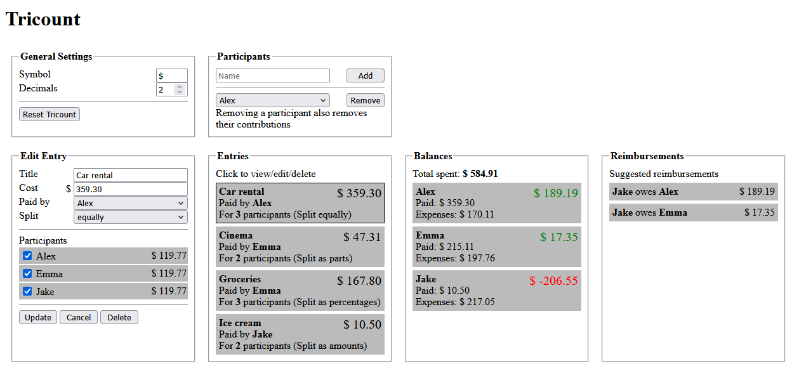

# Tricount

A simple Tricount web implementation, inspired from the [original version](https://tricount.com).

The app allows to manage participants, entries, and gives balances and reimbursement suggestions at the end.

Like the original version, it has three entry modes:

-   **Split equally:** Alex buys one coffee for everyone.
-   **Split as parts:** Alex buys two coffees for Emma and one for himself.
-   **Split as amounts:** Alex buys worth $4 for himself and worth $1 for Emma.

The app automatically saves data inside the browser, so that the Tricount can still be accessed after closing the window.

